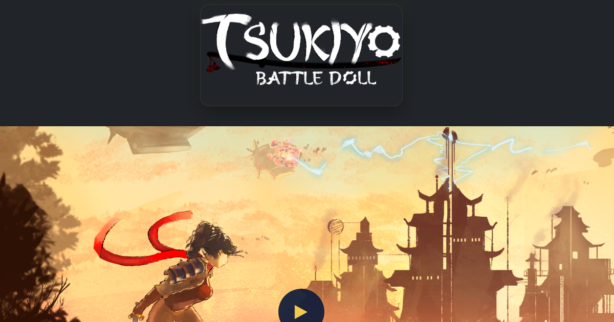

# Juan Carlos Suarez Portfolio Website

Responsive portfolio website developed for a gameplay programmer to showcase projects, gameplay systems and technical game development experience through an interactive and modern front-end experience.

---

# Live Website

https://juancarlosuarez.github.io/gamedevportfolio/

---

# Preview



---

# Overview

This project was developed as a professional portfolio website focused on presenting game development projects through responsive layouts, interactive media systems and modular front-end architecture.

The website includes dynamic project modals, gameplay video previews, reusable UI components and SEO optimized metadata while maintaining full compatibility with GitHub Pages deployment.

Special attention was given to accessibility, responsive behavior, semantic HTML structure and clean code organization.

---

# Features

- Responsive modern portfolio design
- Dynamic navbar and footer components
- Interactive project modal system
- Gameplay video preview integration
- Swiper.js gallery navigation
- Mobile and tablet optimized layouts
- EmailJS contact form integration
- SEO optimized metadata
- Open Graph and Twitter Card support
- Semantic HTML structure
- Accessibility improvements
- GitHub Pages compatible architecture

---

# Technologies Used

- HTML5
- CSS3
- JavaScript
- Bootstrap 5
- Swiper.js
- AOS Animation Library
- EmailJS

---

# Project Structure

```text
index.html
about.html
games.html
contact.html

robots.txt
sitemap.xml

assets/

├── components/
│   ├── navbar.html
│   └── footer.html
│
├── css/
│   └── style.css
│
├── js/
│   ├── main.js
│   └── projects.js
│
├── img/
├── gifs/
├── video/
│
├── favicon.ico
└── preview.png
```

---

# Local Development

Use VSCode Live Server:

1. Open the project folder in VSCode
2. Right click `index.html`
3. Select `Open with Live Server`

Do not open HTML files directly using `file://`

Navbar and footer components are loaded dynamically using JavaScript `fetch()` requests.

---

# GitHub Pages

This project is fully compatible with GitHub Pages deployment.

Main URL:

https://juancarlosuarez.github.io/gamedevportfolio/

---

# What I Learned

While developing this project, I improved my understanding of responsive front-end architecture, reusable UI components, modal systems, multimedia integration and semantic HTML structure.

I also worked on accessibility improvements, SEO optimization, GitHub Pages deployment compatibility and organizing scalable front-end code for maintainability and readability.

---

# Contact

Created by Alejandro Arevalo Rojas.

GitHub:  
https://github.com/alejandroarevaloprogrammer

Portfolio:  
https://alejandroarevalorojas.com/